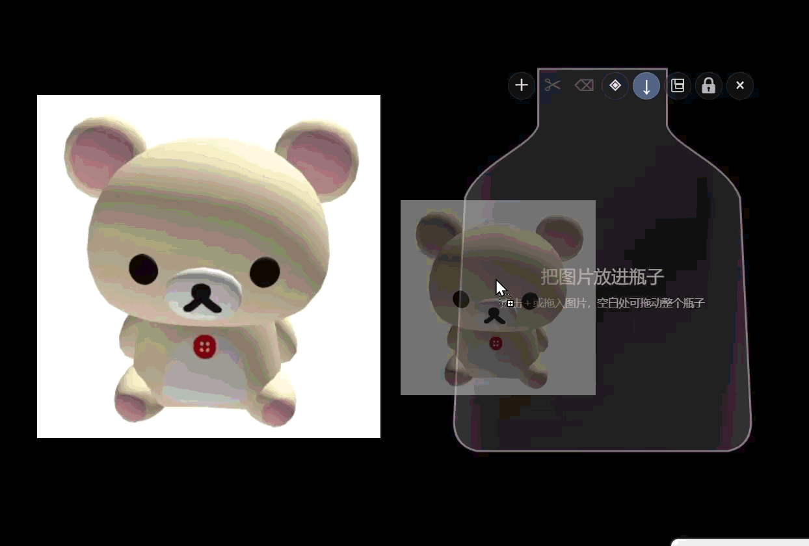
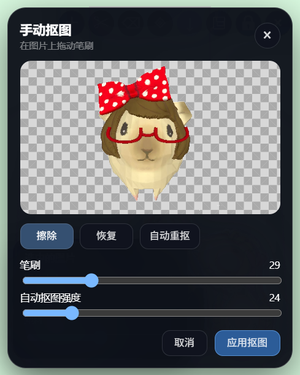

# 摇摇乐 · Shake Pet

把喜欢的图片放进透明桌面容器里。拖动、晃动窗口时，图片会跟着重力碰撞、旋转和堆叠，像一个可以自己装饰的桌面摇摇乐。

> Windows 桌面应用 · 图片只在本机处理 · 当前仍在持续完善

## 效果预览

### 晃动和碰撞

<p align="center">
  
</p>

### 添加自己的图片

<p align="center">
  
</p>

### 手动抠图

<p align="center">
  
</p>

## 它能做什么

- 从电脑或网页拖入图片，自动去除简单背景
- 使用擦除笔和恢复笔手动修整抠图
- 给图片添加可调节的半透明“塑料框”
- 让图片在容器中碰撞、旋转、堆叠并随窗口晃动
- 显示实时音频波形，并让图片随 Windows 音乐、视频或游戏声音的波峰起落
- 直接拖动图片调整位置，并为每张图片单独调整大小
- 自定义汽水瓶或展示盒的颜色与尺寸
- 保存多个瓶子，随时切换要展示的场景
- 锁定后允许鼠标穿透，不影响操作下面的程序

## 没有编程基础也能使用

### 第一次安装

1. 点击 GitHub 页面右上方绿色的 **Code** 按钮。
2. 选择 **Download ZIP**，下载后完整解压。
3. 双击解压目录中的 `start.bat`。
4. 第一次启动会自动下载 Electron 和物理引擎，请保持网络连接并耐心等待。
5. 窗口出现后，安装就完成了。

如果提示找不到 `npm`，请先安装 [Node.js LTS](https://nodejs.org/en/download)，重新打开电脑上的终端或资源管理器后，再双击 `start.bat`。

### 以后怎么启动

直接双击 `ShakePet.vbs`。它会静默启动摇摇乐，不会一直显示黑色终端窗口。

如果双击后没有反应，可以运行一次 `start.bat` 查看具体错误。

## 三分钟上手

1. 点击右上角 `＋`，或者把图片直接拖进容器。
2. 按住容器空白处移动窗口，里面的图片会产生惯性。
3. 直接拖动某张图片，可以调整它在容器中的位置。
4. 单击图片但不拖动，会出现图片大小和塑料框设置。
5. 点击剪刀按钮，可进入手动抠图。
6. 点击瓶子设置按钮，可调整容器形状、颜色、宽高和新图片的默认大小。
7. 在瓶子设置中开启“跟随电脑音频”，可调整灵敏度、起跳力度和震动强度；鼓点会把图片从瓶底弹起来。
8. 点击软盘图标打开瓶子库，为当前场景命名并保存。
9. 点击锁图标后，鼠标可以穿过摇摇乐操作下面的程序。

解锁方式：点击半透明的小开锁按钮，或按 `Ctrl + Shift + L`。

## 按钮说明

| 按钮 | 用途 |
| --- | --- |
| `＋` | 添加一张或多张图片 |
| 剪刀 | 手动抠图 |
| 删除 | 删除当前选中的图片 |
| 菱形设置 | 调整瓶子、颜色、默认图片大小和容器尺寸 |
| `↓` | 开启或暂停重力 |
| 软盘 | 打开瓶子库，保存或切换场景 |
| 锁 | 开启鼠标穿透 |
| `×` | 关闭程序 |

## 图片与隐私

抠图、场景保存、图片处理和音频分析都在本机完成，不会主动上传图片或声音。音频震动只读取实时频段和音量，不会录制或保存声音。自动抠图更适合纯色或接近纯色的背景；复杂背景可以在手动抠图编辑器中修整。

## 常见问题

<details>
<summary>网页图片拖不进去怎么办？</summary>

有些网站会阻止直接读取图片。可以先把图片保存到电脑，再从资源管理器拖入，或点击 `＋` 选择图片。
</details>

<details>
<summary>锁定后点不到摇摇乐了怎么办？</summary>

点击容器右上方独立显示的半透明开锁按钮，或按 `Ctrl + Shift + L`。
</details>

<details>
<summary>第一次启动下载失败怎么办？</summary>

再次运行 `start.bat`。启动器会使用项目内缓存继续下载，不需要删除整个项目。
</details>

## 开发者运行

<details>
<summary>展开开发命令</summary>

```powershell
npm.cmd install
npm.cmd start
```

主要技术：Electron、Canvas、Matter.js。
</details>

## 作者与来源说明

原创产品构思、交互设计与迭代方向：**isaWLO**<br>
Copyright © 2026 isaWLO. All rights reserved.

本项目由 isaWLO 主导产品与设计决策，并使用 OpenAI Codex 辅助编程实现。详见 [ORIGINALITY.md](ORIGINALITY.md)。Electron、Matter.js 等第三方组件的权利与许可证归各自作者所有。
